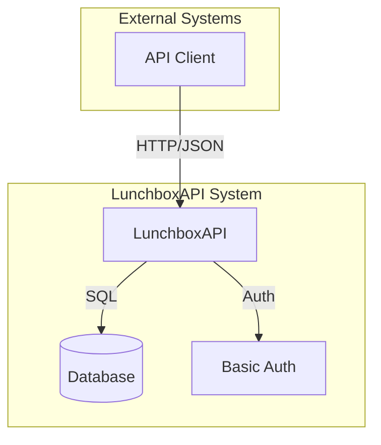
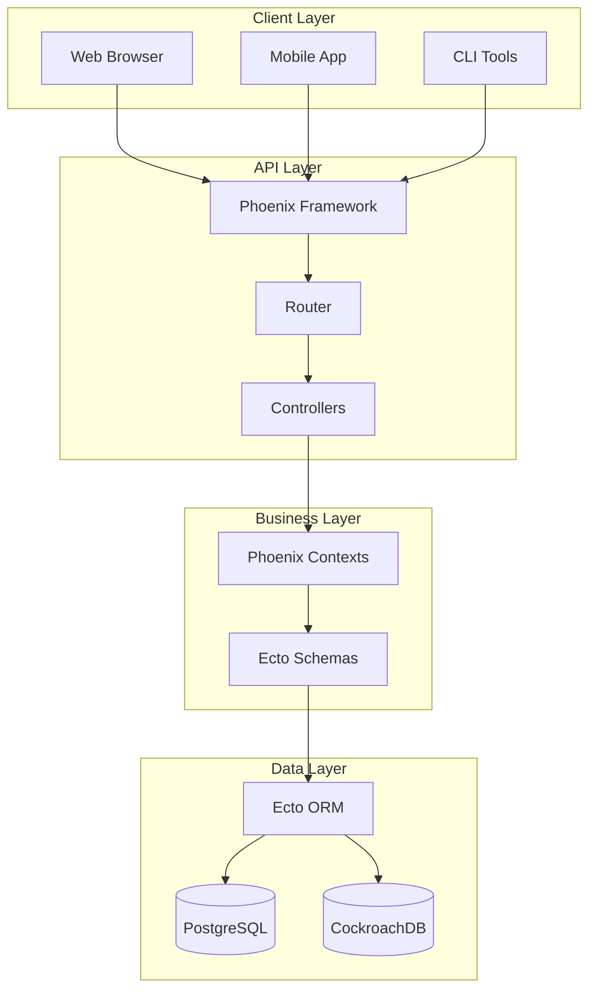
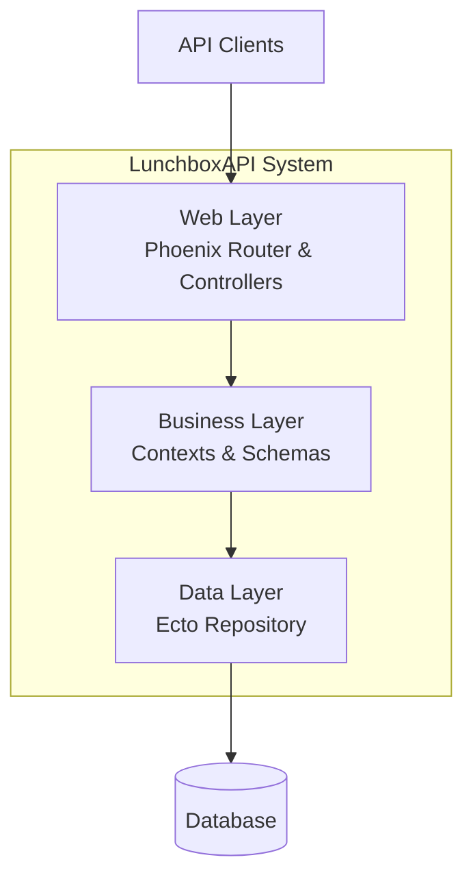
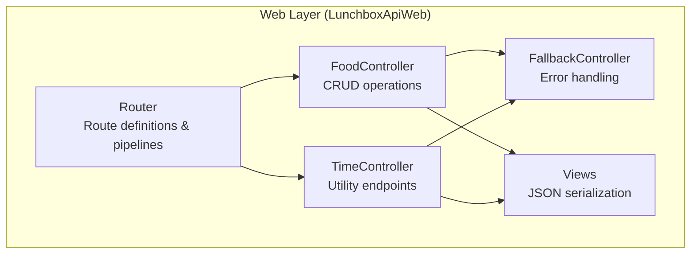
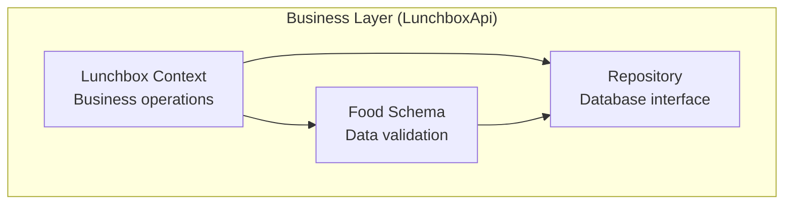
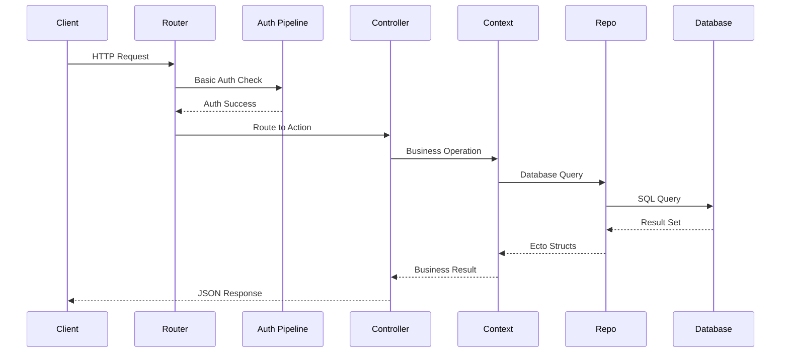
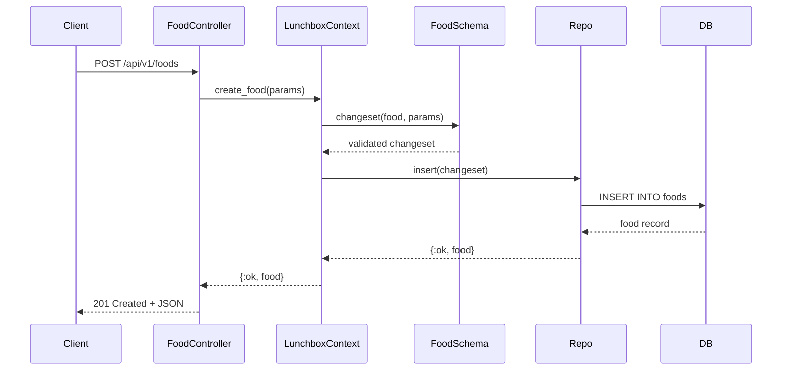
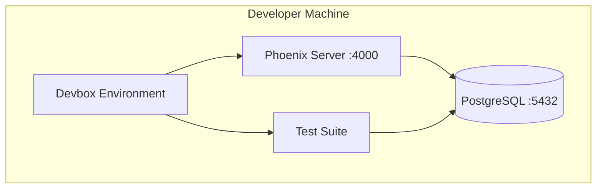
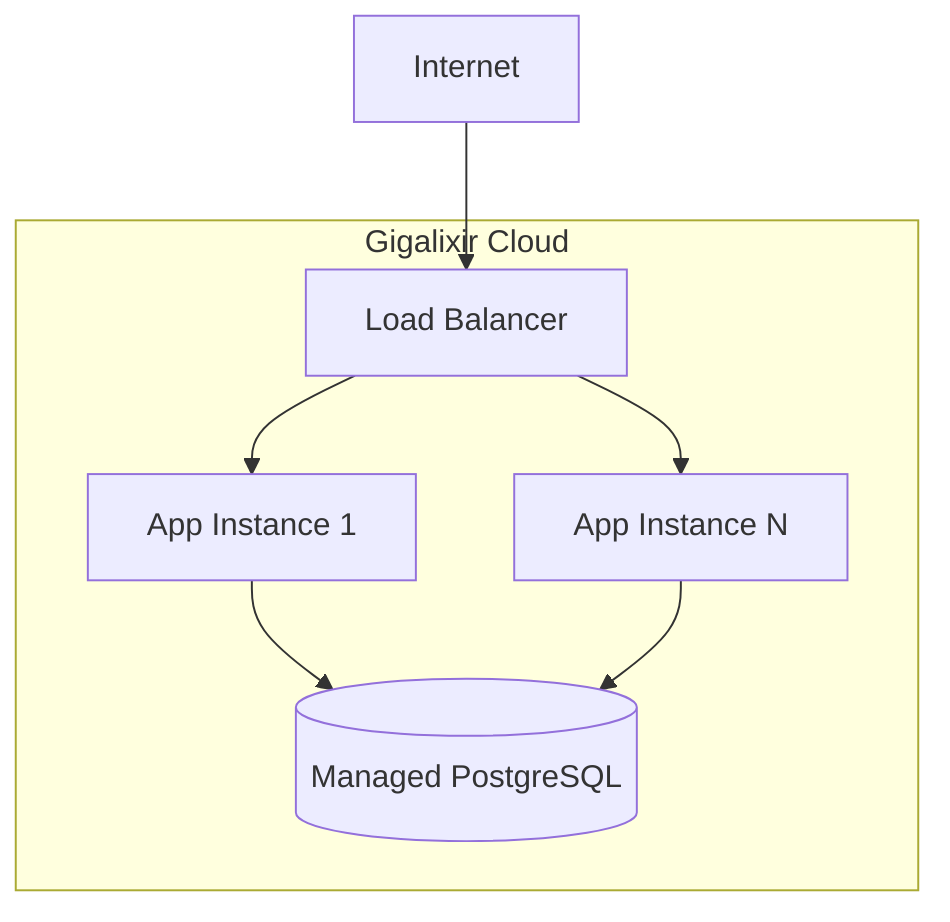
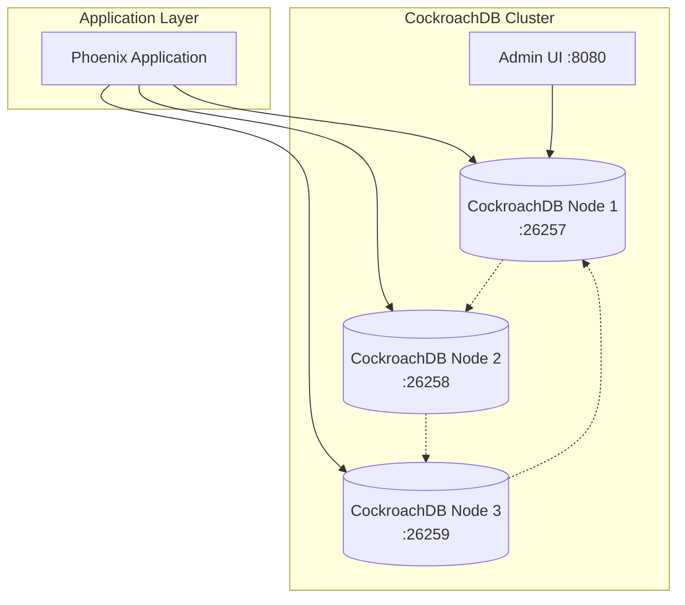

# LunchboxAPI - Arc42 Architecture Documentation

## 1. Introduction and Goals

### 1.1 Requirements Overview
LunchboxAPI is a REST API service for managing food items with the following key requirements:
- CRUD operations for food entities
- HTTP Basic Authentication
- Multi-database support (PostgreSQL/CockroachDB)
- Cloud deployment capability
- Development environment consistency

### 1.2 Quality Goals
| Priority | Quality Goal | Scenario |
|----------|-------------|----------|
| 1 | **Reliability** | API must handle database failures gracefully |
| 2 | **Portability** | Support both PostgreSQL and CockroachDB |
| 3 | **Maintainability** | Clear separation of concerns using Phoenix contexts |
| 4 | **Security** | All API endpoints protected by Basic Auth |
| 5 | **Testability** | Comprehensive test coverage with isolated test environment |

### 1.3 Stakeholders
| Role | Contact | Expectations |
|------|---------|-------------|
| Developer | Development Team | Clean, maintainable code with good test coverage |
| DevOps | Operations Team | Easy deployment and monitoring |
| API Consumer | Client Applications | Reliable, well-documented REST API |

## 2. Architecture Constraints

### 2.1 Technical Constraints
- **Platform**: Elixir/OTP ecosystem
- **Framework**: Phoenix Framework 1.8+
- **Database**: PostgreSQL (dev/test), CockroachDB (production option)
- **Authentication**: HTTP Basic Auth only
- **Deployment**: Gigalixir cloud platform

### 2.2 Organizational Constraints
- **Development Environment**: Devbox for consistency
- **Testing**: All features must have test coverage
- **Configuration**: Environment variable driven

## 3. System Scope and Context

### 3.1 Business Context

### 3.2 Technical Context

## 4. Solution Strategy

### 4.1 Technology Decisions
| Decision | Rationale |
|----------|-----------|
| **Phoenix Framework** | Mature Elixir web framework with excellent performance |
| **Ecto ORM** | Database abstraction supporting multiple adapters |
| **Basic Auth** | Simple, stateless authentication suitable for API |
| **JSON API** | Standard, widely supported data format |
| **Devbox** | Reproducible development environments |

### 4.2 Top-level Decomposition
- **Web Layer**: HTTP handling, routing, authentication
- **Business Layer**: Domain logic, validation, business rules
- **Data Layer**: Database operations, schema definitions

## 5. Building Block View

### 5.1 Level 1: System Overview

### 5.2 Level 2: Web Layer Detail

### 5.3 Level 2: Business Layer Detail

## 6. Runtime View

### 6.1 API Request Flow

### 6.2 Food Creation Flow

## 7. Deployment View

### 7.1 Development Environment

### 7.2 Production Environment (Gigalixir)

### 7.3 Alternative Production (CockroachDB Cluster)

## 8. Cross-cutting Concepts

### 8.1 Security
- **Authentication**: HTTP Basic Auth on all API endpoints
- **Authorization**: Single-tier access (authenticated users have full access)
- **Data Validation**: Ecto changeset validation prevents invalid data
- **Environment Variables**: Sensitive configuration externalized

### 8.2 Error Handling
- **Fallback Controller**: Centralized error response formatting
- **Ecto Changesets**: Validation error collection and reporting
- **Pattern Matching**: Explicit error case handling
- **HTTP Status Codes**: Proper REST status code usage

### 8.3 Testing Strategy
- **Unit Tests**: Schema validation and context functions
- **Integration Tests**: Controller endpoints with database
- **Test Isolation**: Ecto sandbox for database test isolation
- **Test Data**: Factory patterns for test data generation

### 8.4 Configuration Management
- **Environment-based**: Different configs for dev/test/prod
- **External Configuration**: Environment variables for secrets
- **Default Values**: Sensible defaults for development

## 9. Architecture Decisions

### 9.1 ADR-001: Phoenix Framework Choice
**Status**: Accepted  
**Context**: Need for high-performance web API framework  
**Decision**: Use Phoenix Framework with Elixir  
**Consequences**: 
- ✅ Excellent performance and concurrency
- ✅ Mature ecosystem and tooling
- ❌ Learning curve for non-Elixir developers

### 9.2 ADR-002: Multi-Database Support
**Status**: Accepted  
**Context**: Different database requirements for dev vs prod  
**Decision**: Support both PostgreSQL and CockroachDB via Ecto  
**Consequences**:
- ✅ Flexibility in deployment environments
- ✅ Easy local development with PostgreSQL
- ❌ Additional complexity in configuration

### 9.3 ADR-003: Basic Authentication
**Status**: Accepted  
**Context**: Simple API authentication requirement  
**Decision**: Use HTTP Basic Auth  
**Consequences**:
- ✅ Simple implementation and testing
- ✅ Stateless authentication
- ❌ Limited scalability for complex auth scenarios

## 10. Quality Requirements

### 10.1 Performance
- **Response Time**: < 200ms for CRUD operations
- **Throughput**: Handle 1000+ concurrent requests
- **Database**: Connection pooling for efficient resource usage

### 10.2 Reliability
- **Error Handling**: Graceful degradation on database failures
- **Data Integrity**: Ecto changeset validation prevents corruption
- **Monitoring**: Telemetry integration for observability

### 10.3 Maintainability
- **Code Organization**: Phoenix context pattern for clear boundaries
- **Testing**: Comprehensive test coverage (>90%)
- **Documentation**: Clear API documentation and code comments

## 11. Risks and Technical Debt

### 11.1 Current Risks
| Risk | Impact | Probability | Mitigation |
|------|--------|-------------|------------|
| Database vendor lock-in | Medium | Low | Multi-database support via Ecto |
| Basic Auth limitations | Medium | Medium | Plan migration to JWT/OAuth |
| Single point of failure | High | Low | Load balancer and multiple instances |

### 11.2 Technical Debt
- **Authentication**: Basic Auth may not scale for complex scenarios
- **Error Handling**: Could benefit from more granular error types
- **Monitoring**: Limited observability in current implementation
- **API Versioning**: No versioning strategy beyond URL prefix

## 12. Glossary

| Term | Definition |
|------|------------|
| **Context** | Phoenix pattern for organizing business logic |
| **Changeset** | Ecto structure for data validation and transformation |
| **Pipeline** | Phoenix router concept for request processing chains |
| **Schema** | Ecto definition of data structure and validation rules |
| **Supervisor** | OTP pattern for fault-tolerant process management |
| **GenServer** | OTP behavior for stateful server processes |
| **Ecto** | Database wrapper and query generator for Elixir |
| **OTP** | Open Telecom Platform - Erlang/Elixir application framework |